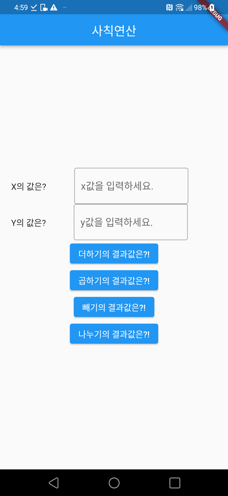
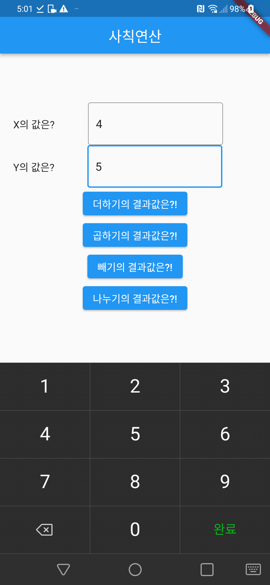
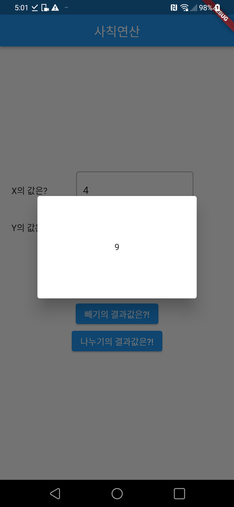

과제 1. 다음 조건을 확인하고, 첨부된 3가지의 이미지 화면과 같은 결과를 만드세요.

- TextField를 두 개 사용하여 변수에 저장합니다.
- 사칙연산이 가능하도록 버튼을 4개 만듭니다. 각각의 버튼(+,-,*,/)를 누르면 해당 연산자에 맞는 결과값을 출력합니다.
- 이 때, 결과값은 **다이얼로그(Dialog)**로 출력합니다.
Dialog란, 앱에서 팝업창처럼 화면위에 화면을 띄우는것을 말합니다. 
일반적으로 showDialog가 있고, AlertDialog를 주로 사용합니다.
- 계산 결과를 result로 넣으면, 다이얼로그를 출력하는 예시코드가 제공됩니다. 
해당 코드를 활용하여 결과를 화면에 출력하세요.
    
    ```dart
    showResultDialog(BuildContext context, var result) {
    	showDialog(
    				context: context,
    				builder: (context) {
    					return Dialog(
    						shape: RoundedRectangleBorder(
    							borderRadius: BorderRadius.circular(8.0)
    						),
    						child: SizedBox(
    						width: MediaQuery.of(context).size.width / 2,
    						height: 150,
    						child: Center(
    							child: Text("$result", 
    								style: const TextStyle(fontWeight: FontWeight.bold),
    							)
    						),
    					),
    			);
    		},
    	);
    }
    ```